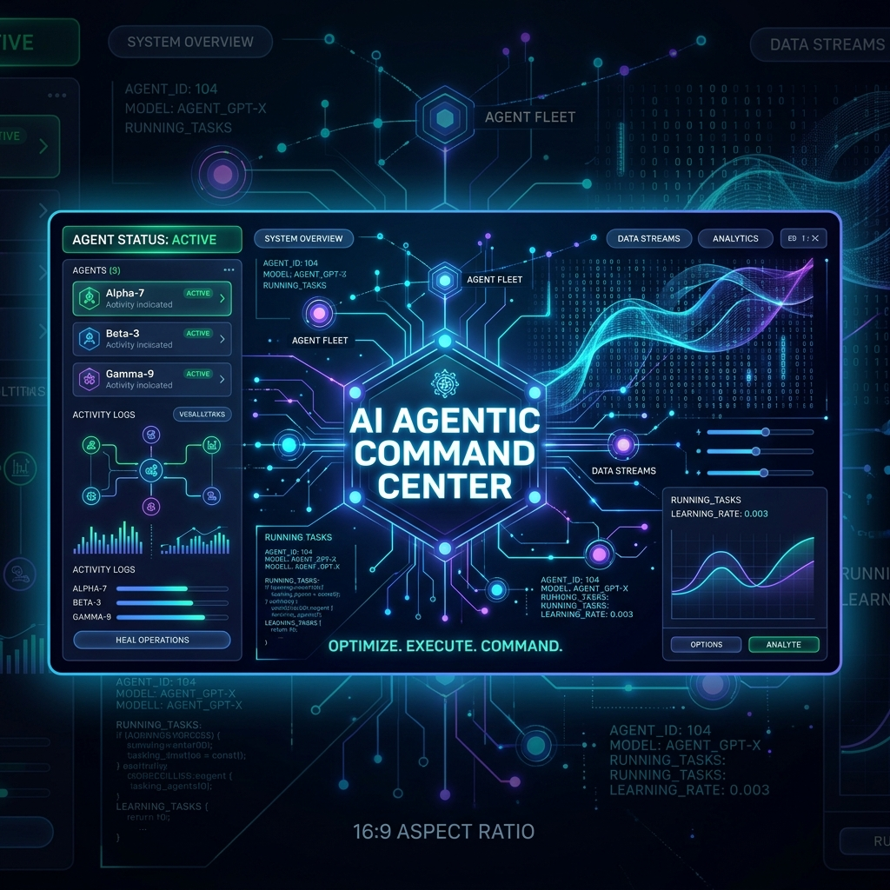

# 🚀 Agentic Operations Hub (agentic-ops-hub)
### The Configuration Control Plane for AI Coding Agents: Claude Code, Cursor, Cline, Copilot, Codex, Antigravity & Grok

One source of truth (`AGENTS.md`), one sync engine, every agent aligned — plus a curated index of the operational layer that keeps autonomous coding agents safe, fast, and consistent.

---

## 🎯 Agentic Ops ≠ AIOps

This repository exists to draw — and own — an exact distinction:

| | **AIOps** (the old term) | **Agentic Ops** (this repo) |
| :--- | :--- | :--- |
| **What it operates** | Enterprise IT infrastructure: logs, metrics, alerts | Autonomous AI coding agents: Claude Code, Cursor, Cline, Codex, Grok |
| **Core mechanism** | ML models detecting anomalies in telemetry | Rules, guardrails, hooks, skills, and MCP servers governing agent behavior |
| **Who runs it** | SRE / platform teams | Developers and creators running multi-agent fleets |
| **Failure mode prevented** | Outages, alert fatigue | Drifted instructions, rogue edits, clobbered worktrees, token waste |
| **Unit of config** | Dashboards, runbooks | `AGENTS.md`, `SKILL.md`, hooks, rule files |

**AIOps** uses machine learning to monitor infrastructure. **Agentic Ops** is the developer-centric discipline of configuring, orchestrating, guarding, and aligning the AI agents that write your code. Different layer, different operator, different failure modes. This repository is the home of Agentic Ops.

---

## 🧠 The Layering Model

Agent instruction files fragmented into a dozen formats. The 2026 resolution is layered:

```
AGENTS.md                      ← universal base (the agents.md standard, plain markdown)
 ├─ CLAUDE.md                  ← thin shim: @AGENTS.md + Claude-only additions
 ├─ .cursor/rules/*.mdc        ← generated (frontmatter, alwaysApply / glob-scoped)
 ├─ .clinerules/*.md           ← generated (directory format)
 ├─ .github/copilot-instructions.md ← generated
 └─ .claude/skills/coding-guardrails/SKILL.md ← generated (auto-activating skill)
```

You edit **one file**. The sync engine generates the rest with tamper-evident headers. CI verifies nothing drifted (`--check`).

> `.cursorrules` (single file) is deprecated — Cursor still reads it, but new projects should use `.cursor/rules/*.mdc`. The sync script emits the legacy file only with `--legacy`.

---

## ⚡ Quick Start

```bash
# 1. Copy the canonical source + sync engine into your project
cp templates/AGENTS.md  /path/to/project/AGENTS.md
cp templates/CLAUDE.md  /path/to/project/CLAUDE.md
mkdir -p /path/to/project/scripts
cp scripts/sync-agent-rules.mjs /path/to/project/scripts/

# 2. Fan out to all agents
cd /path/to/project && node scripts/sync-agent-rules.mjs

# 3. (CI) Fail the build if any generated rule file drifted
node scripts/sync-agent-rules.mjs --check
```

Templates ship the **Top Thinkers Guardrails** (Karpathy, Feynman, Ousterhout, Hickey, Torvalds, Beck) and a **Multi-Agent Coordination Protocol** for running several harnesses against one repo without clobbering each other.

---

## 🌌 Position in the FrankX Ecosystem

Agentic Ops is a stack. Each repo owns one layer — agentic-ops-hub is the **config control plane** that aligns them:

| Layer | Repo | Owns |
| :--- | :--- | :--- |
| **Config control plane** | **agentic-ops-hub** (you are here) | Rule source-of-truth, cross-agent sync, the Agentic Ops index |
| Capability system | [agentic-creator-os](https://github.com/frankxai/agentic-creator-os) | 90+ skills, 65+ commands, 38 agents — what agents *can do* |
| Lifecycle enforcement | [claude-code-hooks](https://github.com/frankxai/claude-code-hooks) | Quality gates, circuit breakers, audit trails — what agents *may do* |
| Integration health | [mcp-doctor](https://github.com/frankxai/mcp-doctor) | Diagnose/optimize MCP servers — what agents *connect to* |
| Machine health | [peak-performance](https://github.com/frankxai/peak-performance) | System auditing for agent-heavy machines — what agents *run on* |
| Memory substrate | [second-brain-os](https://github.com/frankxai/second-brain-os) · [Starlight-Intelligence-System](https://github.com/frankxai/Starlight-Intelligence-System) | Persistent knowledge + the SIP protocol — what agents *remember* |
| Prompt layer | [prompt-engine](https://github.com/frankxai/prompt-engine) · [prompt-library](https://github.com/frankxai/prompt-library) | Evaluated, red-teamed prompts — what agents *are told* |
| Domain expertise | [claude-skills-library](https://github.com/frankxai/claude-skills-library) | Deep research-backed domain skills — what agents *know* |

Rule of thumb: **capabilities live in ACOS, enforcement lives in hooks, configuration alignment lives here.** If a file tells multiple agents how to behave in a repo, this hub owns its lifecycle.

---

## 🏛️ Curated Agentic Ops Index

The best external repositories, toolkits, and skills for operating AI coding agents:

### 1. Behavior & Guardrails
* [forrestchang/andrej-karpathy-skills](https://github.com/forrestchang/andrej-karpathy-skills) — The original viral Karpathy rules for Claude Code.
* [vercel-labs/agent-skills](https://github.com/vercel-labs/agent-skills) — Vercel's official prompt library for coding agents.
* [wsimmonds/claude-nextjs-skills](https://github.com/wsimmonds/claude-nextjs-skills) — Evaluators and NextJS testing patterns.

### 2. Standards
* [agentsmd/agents.md](https://github.com/agentsmd/agents.md) — The AGENTS.md standard: one plain-markdown file, every agent reads it.
* [modelcontextprotocol](https://modelcontextprotocol.io) — MCP, the integration standard for agent ↔ tool connectivity.

### 3. Operational Frameworks & CLI Tools
* [affaan-m/ECC](https://github.com/affaan-m/ECC) — Everything Claude Code. Commands, skills, and security audits via `AgentShield`.
* [smithery-ai/mcp-servers](https://smithery.ai) — Index of MCP integrations.
* [giuseppe-trisciuoglio/developer-kit](https://github.com/giuseppe-trisciuoglio/developer-kit) — Operational scripting and helper toolkits.

### 4. Skill Registries
* [sickn33/antigravity-awesome-skills](https://github.com/sickn33/antigravity-awesome-skills) — 500+ skills for Antigravity, Grok, and Codex environments.

---

## 📁 Repository Structure

* `/templates` — `AGENTS.md` (canonical source), `CLAUDE.md` (shim), legacy `.cursorrules`/`.clinerules`, ACOS `SKILL.md`.
* `/scripts` — `sync-agent-rules.mjs`: fan-out + `--check` CI verification + `--legacy` compat.
* `/docs` — `layering.md`: what goes in which file, and why.
* `/docs/slack-agentic-operating-map.md` — Slack channel, repo-cluster, and agent-team map for coordinating the business fleet.
* `/docs/codex-automation-social-approval-map.md` — Codex automation recommendations, Claude automation inventory, and social approval routing.

---

## 📜 License
MIT License. Free to use, fork, and distribute. Contribution PRs are welcome!
