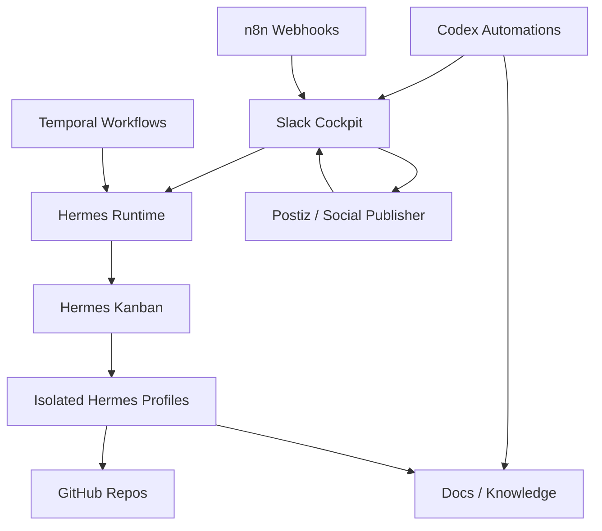

# Hermes Portfolio Runtime and Client Template

Created: 2026-06-19  
Purpose: merge Hermes' runtime recommendations with Starlight Portfolio OS, then turn the system into a reusable architecture for Frank's estate, community education, and client implementations.

## Integrated Thesis

The best system has two layers:

1. **Starlight Portfolio OS**: the operating model for decisions, Slack, GitHub, docs, approvals, proof, and learning.
2. **Hermes Portfolio Runtime**: the live execution layer using Hermes profiles, kanban, cron, gateways, skills, memory, and isolated agent identities.

Together:

```text
Signal -> Decision -> Work -> Proof -> Distribution -> Learning
          |            |       |        |                 |
        Slack       Hermes   GitHub   Social           Memory
       cockpit     runtime   truth   channels          + evals
```

Slack is the cockpit. Hermes is the runtime. GitHub is code truth. Docs are durable memory. Codex is recurring synthesis and implementation prep. Claude Code is deep local execution. n8n and Temporal handle deterministic automation. Postiz or the social publisher handles approved social scheduling.

## What Hermes Added

Hermes correctly identified the gap: the docs and architecture were strong, but live runtime execution was still nascent. The system needed:

- isolated Hermes profiles per brand/function
- kanban initialized as the shared task board
- gateways per profile once credentials are configured
- crons per profile once schedules are approved
- role skills for guardian, strategy, ops, content, dev, research, growth, visual, and revenue
- Starlight as the meta-orchestrator
- reusable packaging for community and clients

## Runtime State Set Up Today

Validated commands:

```powershell
hermes profile create --help
hermes profile list
hermes kanban init
hermes kanban stats
hermes cron list
```

Created Hermes profiles:

| Profile | Role |
| --- | --- |
| `starlight` | portfolio orchestrator, substrate, fleet governance, repo ownership, cross-brand routing |
| `gencreator` | GenCreator / ACOS creator OS products, creator workflows, departments, AI-native creator systems |
| `arcanea` | creative platform, world engine, visual intelligence, studio workflows, media/IP assets |
| `frankx` | authority, content, audience, funnel, offers, newsletter, film prep, demand generation |
| `income` | affiliate engine, passive-income sites, pricing, revenue experiments, commercial content |
| `aicoe` | AI-Architect / AI CoE, Oracle/OCI expertise, academy, partner prep, enterprise offers |
| `reality` | Reality Architect method, vault, transformation content, paid playbooks, public/private boundary |
| `research` | psychology, neuroscience, mind intelligence, source-backed synthesis, claims risk |
| `tooling` | Claude skills, hooks, MCP tooling, templates, awesome lists, security, developer trust |
| `anime` | Anime Legends media IP, story/canon, visual assets, community loops, media launch workflows |
| `mind` | Mind Intelligence: psychology, neuroscience, research-intelligence systems, mind palace, family/health intelligence, and claim-risk governance |

Initialized:

- Hermes kanban database at `C:\Users\frank\AppData\Local\hermes\kanban.db`
- profile wrappers in `C:\Users\frank\.local\bin`

Not started yet:

- profile gateways
- cron scheduler jobs
- live autonomous dispatch

Reason: Hermes reported profile-specific setup/API keys are not configured and gateways are stopped. Starting gateways before credentials and channel policies are configured would create brittle runtime behavior.

## Distributed 24/7 Device Runtime

The live runtime is now defined in `DISTRIBUTED_24_7_AGENT_OPERATIONS_2026-06-19.md`.

Default architecture:

- Yoga Book 9i is the primary command and creative workstation.
- The second Lenovo Yoga is the satellite backend, repo, QA, research, and batch worker.
- `starlight` is the only first gateway candidate.
- `tooling` and `research` are the first satellite-profile candidates after the second laptop is healthy.
- Brand publishing profiles stay stopped until social/customer approval gates are proven.
- `mind` is treated as a first-class research/method brand, but stays stopped until private/public boundaries, source proof, and health-sensitive output gates are tested.

Default autonomy:

- Agents may research, triage, draft, test, prepare PRs, prepare reports, and queue work.
- Agents may not publish, merge, deploy to production, spend money, message customers, or post externally without explicit approval.
- Claude Code, Antigravity, Grok, and similar heavy coding agents are specialist execution harnesses invoked by humans or approved Hermes tasks. They do not run as uncontrolled 24/7 daemons.

Health model:

| Zone | Runtime behavior |
| --- | --- |
| GREEN | spawn approved workers within concurrency limits |
| YELLOW | finish current work, queue new work, avoid new heavy sessions |
| RED | no new workers, stop unsafe runtime, run safe cleanup, report status |

Device concurrency defaults:

| Device | Heavy-session limit |
| --- | --- |
| Yoga Book 9i | 4 |
| Second Lenovo Yoga | 2-3 |

Sync policy:

- Code moves by Git.
- Syncthing may move vaults, inbox, scratch, notes, and handoffs only.
- Never sync `.git`, tokens, sessions, logs, caches, Hermes/Codex/Claude/Grok/Antigravity state, MCP credentials, `node_modules`, `.venv`, `.next`, `.turbo`, lock files, PID files, or ports.

## Profile Activation Checklist

Use this for each profile before enabling live autonomy:

```md
Profile:
Brand/function:
Slack channels:
GitHub repos:
Skills enabled:
Tools enabled:
Memory policy:
Approval gates:
Public/private boundary:
Gateway token configured:
Cron jobs approved:
Kanban assignee active:
Human approver:
```

Activation order:

1. `starlight`
2. `frankx`
3. `arcanea`
4. `gencreator`
5. `tooling`
6. `research`
7. `mind`
8. `aicoe`
9. `income`
10. `reality`
11. `anime`

Mind activation requires extra proof:

- source-backed research path works
- claim-risk labels are used
- private/vault/family/health boundaries are explicit
- no medical advice or diagnosis is produced
- public-facing outputs route through approval

## Live Runtime Architecture



## Work Routing Rule

Every task must resolve to:

```json
{
  "signal": "what happened or what is needed",
  "decision": "what must be decided, if anything",
  "brandUnit": "FrankX Demand",
  "profile": "frankx",
  "channel": "#brand-frankx",
  "repoOrAsset": "frankx.ai-vercel-website",
  "approvalGate": "#brand-frankx + #repo-command",
  "proofRequired": ["PR", "preview URL", "screenshot"],
  "learningLoop": "where the result is recorded"
}
```

Canonical brand-agent ownership is registered in `C:\Users\frank\starlight\ecosystem.json` under `brandAgents`, `operatingSurface`, and `executionDoctrine`.

## Role System

Every brand/client gets the same role spine:

| Role | Job | Can be Hermes profile? |
| --- | --- | --- |
| Orchestrator | routes work, resolves priority, dispatches specialists | yes |
| Strategy Lead | sets business priorities, audience, offers, narrative | yes |
| Ops Lead | owns cadence, queue, blockers, reports | yes |
| Research Lead | sources, scans, synthesis, claim checks | yes |
| Content Lead | scripts, posts, briefs, newsletters, film prep | yes |
| Growth Lead | distribution, social, analytics, experiments | yes |
| Dev / Build Lead | repos, PRs, builds, deploys, verification | yes |
| Guardian | brand, legal-adjacent risk, privacy, approvals | yes |
| Memory / Knowledge Lead | docs, registry, onboarding, handoffs | yes |

For a founder or creator, one profile can hold multiple roles. For an enterprise, split roles into teams with separate profiles, permissions, and channels.

## Reusable Client Architectures

### Founder / Solo Operator

Goal: one person with a small AI staff.

Recommended setup:

- Slack channels: `#hq`, `#daily`, `#content`, `#sales`, `#build`, `#approvals`
- Hermes profiles: `founder`, `content`, `sales`, `build`, `research`
- Codex automations: daily digest, content prep, revenue blocker monitor, weekly review
- GitHub/docs: one command repo, one public site repo, one private strategy vault

Best for:

- consultants
- indie founders
- creators building products
- solo agencies

### SMB / Agency

Goal: many clients, repeatable delivery, low chaos.

Recommended setup:

- Slack channels: `#hq`, `#ops-delivery`, `#client-*`, `#approvals`, `#sales`, `#support`
- Hermes profiles: `orchestrator`, `client-success`, `content`, `ads`, `web`, `research`, `support`
- Codex automations: client digest, approval monitor, delivery risk sweep, weekly account review
- GitHub/docs: client registry, campaign templates, support knowledge base

Best for:

- marketing agencies
- service businesses
- productized consulting shops

### Influencer / Creator Media Company

Goal: content velocity with brand safety and monetization.

Recommended setup:

- Slack channels: `#brand`, `#content-command`, `#film-prep`, `#social-approvals`, `#sponsorships`, `#analytics`
- Hermes profiles: `creator-chief`, `research`, `scriptwriter`, `editor`, `social`, `sponsorships`
- Codex automations: trend scan, film prep builder, social approval monitor, weekly content performance
- GitHub/docs: content repo, offer repo, media kit, sponsor CRM

Best for:

- YouTubers
- newsletter writers
- educator-creators
- personal brands

### University / Research Lab

Goal: research, knowledge, governance, student/faculty collaboration.

Recommended setup:

- Slack channels: `#lab-hq`, `#research-intel`, `#paper-pipeline`, `#grant-ops`, `#student-agents`, `#ethics-review`
- Hermes profiles: `lab-orchestrator`, `literature`, `methods`, `data`, `writing`, `grant`, `ethics`
- Codex automations: literature digest, paper pipeline status, grant deadline monitor, ethics/risk checklist
- GitHub/docs: lab registry, dataset registry, paper repo, reproducibility templates

Best for:

- AI labs
- university departments
- research groups
- student agent teams

### Enterprise / Department

Goal: governed AI operations with RBAC, auditability, approvals, and integration.

Recommended setup:

- Slack channels: `#ai-coe-hq`, `#use-case-intake`, `#risk-review`, `#delivery`, `#platform`, `#executive-brief`
- Hermes profiles: `coe-orchestrator`, `risk-guardian`, `platform`, `analytics`, `change-management`, `support`
- Codex automations: executive digest, use-case triage, risk review prep, delivery portfolio review
- GitHub/docs: policy repo, use-case registry, evals repo, audit logs, architecture decision records

Best for:

- AI CoEs
- enterprise transformation teams
- regulated organizations
- partner ecosystems

## Productization Path

Package this as:

1. **Agentic Organization OS Starter**
   - docs, Slack naming, channels, onboarding, simple automations
2. **Founder Agent Staff Kit**
   - Hermes profiles, content/sales/build/research roles, weekly review
3. **Creator Media OS**
   - film prep, social approvals, sponsor/offer engine, analytics loop
4. **SMB Agent Ops Kit**
   - client delivery, approval queues, support knowledge, weekly account reviews
5. **AI CoE Operating System**
   - use-case intake, risk review, governance, enablement, executive reporting
6. **Starlight Enterprise Agent Runtime**
   - profiles, kanban, cron, gateways, evals, memory, auditability, templates

Use Frank's estate as the reference implementation and case study.

## Template Quality Bar

Every client/community template needs:

- one-page architecture
- Slack channel map
- role/profile map
- intake form schema
- approval gates
- daily/weekly cadence
- automation list
- onboarding prompt
- repo/document structure
- public/private data rules
- proof standard
- first 7-day launch plan

## First 7-Day Launch Plan For Any Client

### Day 1: Map

- identify business units or workflows
- choose Slack naming convention
- map repos/docs/tools
- define approvals and risks

### Day 2: Create

- create core Slack channels
- create onboarding post/canvas
- create initial docs
- create first Hermes profiles if using Hermes

### Day 3: Intake

- define work intake form
- define social/content approval form
- define repo/build risk form
- define proof template

### Day 4: Automate

- daily digest
- approval monitor
- blocker sweep
- weekly review

### Day 5: Run

- run one real workflow through the system
- capture proof
- find friction

### Day 6: Harden

- add missing docs
- reduce channel noise
- set approval gates
- add role prompts

### Day 7: Review

- executive review
- archive unnecessary channels
- promote next workflows
- package the system as a repeatable template

## Immediate Next Steps For Frank's Estate

1. Run `umwelt-scan` on Yoga Book and second Lenovo Yoga.
2. Confirm Syncthing excludes forbidden runtime and secret lanes.
3. Keep all Hermes gateways stopped except the explicitly approved `starlight` first-gateway test.
4. Configure gateway credentials for `starlight` first.
5. Create Slack anchor posts for command rooms and approval rooms.
6. Run one read-only `starlight` kanban test with proof.
7. Create `portfolio-repo-registry.json` from the 267-repo audit after the read-only path is proven.
8. Add second Yoga as satellite worker only after telemetry is GREEN.
9. Activate `tooling` or `research` before any brand publishing profile.
10. Keep Codex heartbeat as the daily synthesis layer until detached Hermes cron support is proven.
11. Build the public/community template from `templates/agentic-org-os/`.
