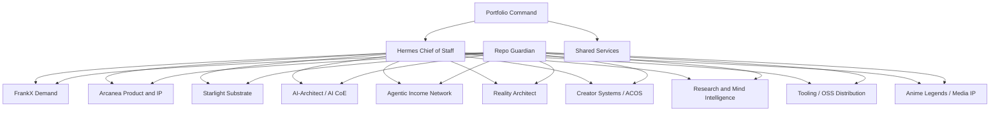

# Multi-Brand Agent Operating System

Created: 2026-06-19  
Timezone: Europe/Amsterdam  
Scope: FrankX, Arcanea, Starlight, AI-Architect, Reality Architect, Agentic Income, creator systems, research intelligence, open-source tooling, and all active `frankxai` GitHub projects.

Companion operating layer: `agentic-ops-hub/docs/EXECUTIVE_SLACK_CODEX_OPERATING_SYSTEM_2026-06-19.md`
Runtime and client-template layer: `agentic-ops-hub/docs/HERMES_PORTFOLIO_RUNTIME_AND_CLIENT_TEMPLATE_2026-06-19.md`

## Executive Thesis

The estate should not be managed as one giant brand. It should be managed as a portfolio:

1. Portfolio Command sets priorities, capital allocation, risk posture, and proof standards.
2. Brand Operating Units own markets, audiences, products, channels, and their repo constellations.
3. Shared Services provide Hermes dispatch, repo governance, research, design, social publishing, deployment, automation, and analytics.
4. Every repo belongs to one Brand Operating Unit or one Shared Service. No active repo should be unowned.
5. Every public action flows through an approval gate: publish, send, merge, deploy, spend, or partnership.

Slack is the human command surface. GitHub is the source of code truth. `agentic-ops-hub` is the agent-readable control plane. Hermes is the dispatcher that turns signals into owned work.

The executive Slack layer should be run as **Starlight Portfolio OS**:

```text
Signal -> Decision -> Work -> Proof -> Distribution -> Learning
```

## Current Evidence

Evidence sources:

- `C:\Users\frank\starlight\ecosystem.json`
- `C:\Users\frank\starlight\repos\GITHUB_267_REPO_AUDIT_2026-06-18.md`
- `C:\Users\frank\starlight\repos\github_remote_audit_2026-06-18.json`
- `agentic-ops-hub/docs/ECOSYSTEM_COMMAND_CENTER_2026-06-18.md`
- `agentic-ops-hub/ops/OPS-LEDGER.md`
- `hermes-cockpit/registry.json`

Estate reality as of 2026-06-18:

| Signal | Count / status | Operating meaning |
| --- | ---: | --- |
| Live GitHub repos | 267 | Requires registry-driven portfolio governance. |
| Active repos | 225 | Too large for ad-hoc memory or one-channel management. |
| Archived repos | 42 | Keep out of active planning unless revived. |
| Public repos | 176 | Brand, IP, and trust surface must be guarded. |
| Private repos | 91 | Strategy, memory, vault, and unfinished product surfaces need stricter routing. |
| Recent active repos | 96 in 7 days | Work velocity is high enough to need daily proof loops. |
| Agent-style branches | 56 | Agent work needs promotion, review, and closeout cadence. |
| Risk-flagged repos | 83 | Need repo guardian and brand owner decisions. |

## First-Pass GitHub Routing

The 267-repo audit must become a portfolio registry. A first-pass name-based classifier over the 225 active repos gives this starting picture:

| Operating unit | First-pass active repo count |
| --- | ---: |
| FrankX Demand | 20 |
| Arcanea Product and IP | 50 |
| Anime Legends / Media IP | 3 |
| Starlight Substrate | 24 |
| AI-Architect / AI CoE | 16 |
| Agentic Income Network | 9 |
| Reality Architect | 5 |
| Creator Systems / ACOS | 6 |
| Research and Mind Intelligence | 10 |
| Tooling / OSS Distribution | 37 |
| Music Intelligence incubator | 5 |
| Health Intelligence incubator | 1 |
| Unassigned / manual review | 81 |

This is not the final registry. It is the triage pass. The rule is:

1. Auto-route obvious prefixes and canonical ecosystem repos.
2. Manually review ambiguous repos.
3. Promote real businesses or product lines into Brand Operating Units.
4. Keep experiments in incubator lanes until they earn a dedicated channel and agent squad.
5. Archive, park, or mark dormant repos that do not serve the portfolio.

Current incubator lanes:

| Incubator | Likely repos | Decision needed |
| --- | --- | --- |
| Music Intelligence | `agentic-music-os`, `agentic-music-producer-os`, `ai-music-academy`, `claude-code-music-production`, `suno-mcp-server` | Decide whether this is a standalone brand, a FrankX content vertical, or an Arcanea studio capability. |
| Health Intelligence | health / wellness / fitness surfaces | Decide whether this belongs under Research Intelligence, Arcanea creator verticals, or a separate professional content lane. |
| Dream / Life / Library Intelligence | `dream-intelligence-system`, `agentic-life-os`, `library-os`, `Goals-and-dreams` | Decide whether these feed Reality Architect, Research Intelligence, or private second-brain systems. |
| Investor Intelligence | `GenInvestor`, `investor-intelligence*` | Decide whether this is a commercial vertical, research lane, or archive candidate. |
| Chat / exporter / starter forks | `ai-chat-exporter`, `chat-export`, `next-chat`, `nextjs-ai-chatbot`, `lobe-chat*` | Decide whether these are reusable tooling, old experiments, or archive candidates. |

## Portfolio Structure

Use this operating shape:



## Brand Operating Units

### 1. FrankX Demand

Mission: turn Frank's authority, writing, frameworks, and audience into trust, owned attention, and conversion paths.

Command channel: `#brand-frankx`  
Existing support channels: `#frankx-growth`, `#content-comms`, `#content-film-prep`, `#social-command`, `#social-approvals`

Primary repos:

- `frankx.ai-vercel-website`
- `FrankX`
- `author-os`
- `prompt-engine`
- `prompt-library`
- audience-facing content and newsletter surfaces

Agent squad:

- Brand GM: picks daily commercial narrative and offer priority.
- Editorial Director: owns articles, newsletters, books, and authority POV.
- Funnel Architect: owns FrankX to GenCreator / CoE bridge and CTAs.
- Film Producer: turns research into recording-ready briefs.
- Social Distributor: converts long-form into X, LinkedIn, YouTube, TikTok, Threads, Bluesky, Farcaster variants.
- Analytics Agent: reports traffic, conversion, content decay, and winning themes.
- Brand Guard: checks claims, public/private boundaries, tone, and IP safety.

Daily outputs:

- one audience insight
- one content or filming package
- one conversion improvement or funnel check
- one proof link: PR, article, draft, analytics note, or approval

Current priority:

- repair and operationalize the FrankX to GenCreator / CoE bridge before creating more unfocused content.

### 2. Arcanea Product and IP

Mission: build the creative platform, world engine, creator workflows, studio systems, visual intelligence, and premium experience layer.

Command channel: `#brand-arcanea`  
Existing support channels: `#arcanea`, `#design-intelligence`, `#execution-room`, `#content-comms`

Primary repos:

- `arcanea-ai-app`
- `arcanea-orchestrator`
- `arcanea-agent-skills`
- `arcanea-ecosystem`
- `arcanea-studio`
- `arcanea-claw`
- `arcanea-flow`
- `gencreator.ai`
- `visual-intelligence`
- `kura`
- `arcanea-*` satellites

Agent squad:

- Product GM: owns platform roadmap, creator promise, and release order.
- World Engine Lead: owns lore, IP consistency, canon, and productized creative systems.
- Engineering Lead: owns app health, PRs, deploys, and repo quality gates.
- Design Director: owns visual system, motion quality, and premium experience bar.
- Community / Retreat Producer: maps physical and digital experiences into the product loop.
- Marketplace Lead: packages templates, skills, media kits, and creator products.
- QA / Release Agent: verifies builds, previews, screenshots, and production readiness.

Daily outputs:

- one shippable product improvement or PR decision
- one creator/IP asset moved toward release
- one design or visual QA proof when UI/media changes
- one blocker escalated with owner and next action

Current priority:

- land world-engine and agent-runtime work through reviewable PRs, then connect Arcanea/GenCreator to FrankX demand.

### 3. Starlight Substrate

Mission: provide the intelligence substrate, agent memory, orchestration, evals, governance, and machine/repo reliability that powers every brand.

Command channel: `#brand-starlight`  
Existing support channels: `#starlight-systems`, `#agent-teams`, `#mcp-integrations`, `#repo-command`

Primary repos:

- `Starlight-Intelligence-System`
- `agentic-creator-os`
- `second-brain-os`
- `starlight-swarm`
- `starlight-agent-skills`
- `starlight-agent-army-architecture`
- `starlight-design-intelligence`
- `starlight-cosmos-engine`
- `starlight-knowledge-tree`
- `starlight-command-center`
- `starlight-devices`
- `hermes-cockpit`

Agent squad:

- Substrate Architect: owns the technical doctrine and system map.
- Agent Runtime Lead: owns capabilities, skills, commands, and swarm behavior.
- Memory / Knowledge Lead: owns long-term context, registries, and source-of-truth syncing.
- Evals Lead: owns prompt, model, workflow, and agent quality checks.
- Infrastructure Lead: owns local machine, Railway, MCP, LiteLLM, Langfuse, Redis/Postgres, and secrets posture.
- Repo Guardian: owns branch health, PR promotion, default branch exceptions, and stale agent branches.

Daily outputs:

- one substrate health signal
- one repo/fleet governance action
- one automation or quality gate improvement
- one risk or capacity note

Current priority:

- turn the 267-repo audit into a real fleet registry and make agent work reviewable, traceable, and promotable.

### 4. AI-Architect / AI CoE

Mission: convert enterprise AI architecture, Oracle/OCI expertise, and CoE frameworks into cashflow, authority, training, and partner-ready assets.

Command channel: `#brand-ai-coe`  
Existing support channels: `#ai-coe`, `#research-intel`, `#revenue-ops`

Primary repos:

- `ai-coe`
- `oci-ai-architect`
- `claude-code-oracle-skills`
- `ai-architect-academy`
- `oracle-genai-guides`
- `awesome-ai-coe`
- `ai-migration-consultant`
- `ai-architect*`

Agent squad:

- Offer GM: owns consulting packages, academy products, and account strategy.
- Oracle Research Lead: owns OCI, GenAI, and enterprise architecture research.
- Curriculum Builder: turns expertise into labs, workshops, PDFs, and courses.
- Partner / Sales Agent: prepares outreach, follow-ups, proof packs, and partner motions.
- Compliance / Claims Guard: checks enterprise claims and public/private boundaries.

Daily outputs:

- one offer, asset, or partner-facing improvement
- one research-backed enterprise insight
- one sales or partnership next action
- one proof link or draft

Current priority:

- package Personal CoE / Enterprise CoE offers and connect them to FrankX demand.

### 5. Agentic Income Network

Mission: build honest AI-tool affiliate and passive-income systems that are useful, searchable, defensible, and connected to the broader funnel.

Command channel: `#brand-agentic-income`  
Existing support channels: `#agentic-income`, `#revenue-ops`, `#social-command`

Primary repos:

- `affiliate-agent-skills`
- `agentic-income-template`
- `agentic-income-skills`
- `agenticincome`
- `agenticpassiveincome`
- `disruptivepassiveincome`
- `awesome-agentic-income`
- `agentic-business-os`

Agent squad:

- Revenue GM: owns offer map, affiliate ethics, and monetization priorities.
- Tool Research Lead: validates tools, programs, claims, and alternatives.
- SEO / Content Agent: builds comparison pages, lists, and commercial content.
- Template Productizer: turns the engine into clone-and-deploy assets.
- Analytics Agent: watches traffic, clicks, conversion, and stale links.

Daily outputs:

- one offer/tool/review moved forward
- one affiliate or checkout blocker identified or resolved
- one content page, template, or distribution asset improved
- one compliance note for claims and disclosures

Current priority:

- connect the income network to a clear conversion path instead of treating it as detached side sites.

### 6. Reality Architect

Mission: own the creator-method brand for system-builders: public method, private vault, transformation content, and paid playbooks.

Command channel: `#brand-reality-architect`  
Existing support channels: `#reality-architect`, `#content-film-prep`, `#social-approvals`

Primary repos:

- `realityarchitect`
- `realityarchitect-vault`
- manifestation/system-building/creator-method satellites

Agent squad:

- Method GM: owns promise, doctrine, and curriculum arc.
- Vault Curator: separates public method from private paid material.
- Content Producer: turns method into social, essays, video, and workshops.
- Offer / Community Agent: packages paid Vault, cohorts, and creator systems.
- Brand Guard: checks claims, privacy, and tone.

Daily outputs:

- one public method asset or private vault asset
- one content-to-film brief
- one paid-offer or community action
- one public/private boundary check

Current priority:

- define the free method to paid Vault bridge and ensure private strategy stays private.

### 7. Creator Systems / ACOS

Mission: package reusable creator workflows, skills, commands, and agent teams that make every brand faster.

Command channel: `#brand-creator-systems`  
Existing support channels: `#creator-systems`, `#agent-teams`, `#prompt-systems`

Primary repos:

- `agentic-creator-os`
- `agentic-creator-skills`
- `author-os`
- `context-engineering-for-creators`
- `creator-*`
- `workflow-tier-plugin`

Agent squad:

- Creator OS PM: owns skill and workflow roadmap.
- Workflow Designer: packages repeatable creator automations.
- Prompt / Eval Lead: tests prompts, commands, and outputs.
- Documentation Agent: makes the system usable by future humans and agents.
- Integration Agent: connects ACOS to FrankX, Arcanea, Starlight, and social workflows.

Daily outputs:

- one workflow packaged or improved
- one prompt/eval improvement
- one reusable doc or template
- one adoption path into a brand unit

Current priority:

- promote useful creator workflows from repo artifacts into operating routines used by the brands.

### 8. Research and Mind Intelligence

Mission: turn the research-intelligence and mind-intelligence repos into a coherent intelligence product line and research engine.

Command channel: `#brand-research-intelligence`  
Existing support channels: `#research-intel`, `#knowledge-systems`, `#prompt-systems`

Primary repos:

- `research-intelligence-os`
- `research-intelligence-systems`
- `psychology-research-intelligence-system`
- `neuroscience-research-intelligence-system`
- `human-mind-intelligence-system`
- `mind-intelligence-systems`
- `agentic-mind-os`
- `starlight-mind-os-pro`
- `awesome-mind-agent-skills`
- `claude-scientific-skills`

Agent squad:

- Research GM: owns thesis, taxonomy, and publication priorities.
- Literature Scout: finds and summarizes credible sources.
- Synthesis Agent: converts research into frameworks, product ideas, and content angles.
- Claims Guard: flags weak evidence, overreach, and medical/legal/clinical risks.
- Productizer: decides which research surfaces become tools, courses, or content.

Daily outputs:

- one source-backed insight
- one content/product angle
- one claim-risk note
- one repo or taxonomy improvement

Current priority:

- make the new mind/research repos one coherent constellation instead of a scatter of promising starts.

### 9. Tooling / Open Source Distribution

Mission: own open-source authority, developer trust, skills, hooks, MCP tooling, templates, and awesome lists that feed the broader ecosystem.

Command channel: `#brand-tooling-oss`  
Existing support channels: `#mcp-integrations`, `#repo-command`, `#prompt-systems`

Primary repos:

- `claude-skills-library`
- `claude-code-config`
- `claude-code-hooks`
- `mcp-doctor`
- `workflow-tier-plugin`
- `awesome-agent-operating-systems`
- `awesome-claude-code`
- `awesome-claude-code-subagents`
- `awesome-hermes-agents`
- `coding-agent-template*`
- `agentic-ops-hub`

Agent squad:

- OSS GM: owns reputation, release order, and developer value.
- Maintainer Agent: handles issues, docs, releases, and compatibility.
- Security / Veil Agent: checks secrets, private references, and public/private leaks.
- Distribution Agent: turns useful repos into posts, docs, and lead-gen paths.
- Integration Agent: maps tools into Starlight and brand workflows.

Daily outputs:

- one OSS repo health action
- one public doc/release/distribution improvement
- one security or private-memory check
- one adoption path into the brand ecosystem

Current priority:

- update stale flagship repos and use open-source assets as trust-building distribution, not random shelves.

### 10. Anime Legends / Media IP

Mission: treat Anime Legends as a dedicated media/IP product line, even if it remains strategically under Arcanea.

Command channel: `#brand-anime-legends`  
Existing support channels: `#anime-legends`, `#design-intelligence`, `#content-film-prep`, `#social-approvals`

Primary repos:

- `AnimeLegends`
- `Anime-Legends`
- `AnimeLegends-Skills`
- anime / media / visual pipeline satellites

Agent squad:

- IP GM: owns world, audience, and release plan.
- Story / Canon Lead: owns character, lore, and continuity.
- Visual Director: owns art direction and asset quality.
- Game / Experience Lead: owns interactive product work.
- Social / Community Agent: owns launch clips, teasers, and fan loops.

Daily outputs:

- one asset, story, or product improvement
- one visual QA proof when media changes
- one social/community candidate routed for approval
- one IP risk or continuity note

Current priority:

- decide if Anime Legends is a standalone brand unit or an Arcanea sub-label with its own weekly review.

## Shared Services

These teams support every Brand Operating Unit.

| Shared service | Command channel | Owns | Core agents |
| --- | --- | --- | --- |
| Portfolio Command | `#ops` | priorities, tradeoffs, revenue, risk, human decisions | Portfolio Chief of Staff, Finance/Revenue, Legal/IP, Strategy |
| Hermes Dispatch | `#hermes-agent` | routing, reminders, handoffs, daily loop | Chief of Staff, Execution Dispatch, Profile Health |
| Repo Governance | `#repo-command` | GitHub fleet, branches, PRs, health commands, deployments | Repo Guardian, Release Manager, Risk Auditor |
| Research Desk | `#research-intel` | market scans, source-backed briefs, content ideas | Research Scout, Synthesis, Claims Guard |
| Content Studio | `#content-film-prep` | scripts, shot lists, filming prep, post variants | Film Producer, Editor, Clip Generator |
| Social Desk | `#social-command` / `#social-approvals` | social calendar, platform variants, approvals, publishing | Social Strategist, Platform Agents, Publisher |
| Revenue Ops | `#revenue-ops` | offers, checkout, affiliate, CRM, partnership follow-up | Revenue PM, Sales Agent, Funnel Analyst |
| Infra / MCP / Railway | `#mcp-integrations` | n8n, Temporal, Railway, LiteLLM, Langfuse, secrets, webhooks | Railway Ops, MCP Doctor, Automation Engineer |
| Knowledge Systems | `#knowledge-systems` | memory, docs, registries, Notion/Drive mirrors | Librarian, Registry Curator, Handoff Agent |
| Design Intelligence | `#design-intelligence` | visual QA, motion, brand systems, asset checks | Design Director, Motion QA, Visual Critic |

## Slack Architecture

Use three Slack layers.

### Layer 1: Portfolio rooms

- `#ops`: executive decisions, blockers, allocation.
- `#daily-report`: daily portfolio brief and end-of-day proof.
- `#work-queue`: raw intake before assignment.
- `#execution-room`: active assigned execution with owner/deadline/proof.
- `#repo-command`: branch, PR, deployment, and repo health.
- `#hermes-agent`: dispatcher and automation status.

### Layer 2: Brand command rooms

New standard: `#brand-*` channels are the command room for a brand unit. Existing project channels can remain as workrooms.

Recommended brand command channels:

- `#brand-frankx`
- `#brand-arcanea`
- `#brand-starlight`
- `#brand-ai-coe`
- `#brand-agentic-income`
- `#brand-reality-architect`
- `#brand-creator-systems`
- `#brand-research-intelligence`
- `#brand-tooling-oss`
- `#brand-anime-legends`

Naming rule:

- `#brand-*` = strategy, priorities, daily digest, decisions, proof.
- `#project-*` = temporary project rooms.
- `#repo-*` = repo-specific room only for high-surface repos.
- `#social-*` = platform execution.
- `#ops-*` = shared service operating rooms.

### Layer 3: Social platform rooms

Existing social rooms remain shared services, not brand owners:

- `#social-command`: calendar and cross-platform campaign planning.
- `#social-approvals`: human approval before anything publishes.
- `#social-x`
- `#social-linkedin`
- `#social-instagram`
- `#social-youtube`
- `#social-tiktok`
- `#social-threads`
- `#social-bluesky`
- `#social-farcaster`
- `#social-syndication`

Social rule:

- Brand units create content intent and approve claims.
- Social Desk adapts per platform.
- Human approval is required in `#social-approvals` before publishing or scheduling.
- Performance results return to both `#social-command` and the source brand channel.

## Repo Ownership Rules

1. Every active repo gets `brandUnit`, `sharedService`, `lifecycle`, `riskClass`, `defaultBranch`, `healthCommand`, and `approvalGate`.
2. A repo may feed multiple brands, but it has exactly one operational owner.
3. Production-deploying repos need PR-first work, health commands, deployment policy, and brand-owner approval.
4. Private/vault/memory repos must not be summarized into public channels unless sanitized.
5. Archived repos stay out of daily planning.
6. Dormant repos are reviewed weekly, not daily.
7. Agent-created branches older than 7 days need promote, park, or close decisions.
8. Public repos with brand claims need Brand Guard review before large README, positioning, or release changes.

Recommended registry fields:

```json
{
  "name": "repo-name",
  "brandUnit": "FrankX Demand",
  "sharedService": null,
  "visibility": "public",
  "lifecycle": "active",
  "riskClass": "production",
  "defaultBranch": "main",
  "healthCommand": "npm run build",
  "approvalGate": "#brand-frankx + #repo-command",
  "primarySlack": "#brand-frankx",
  "proofRequired": ["PR", "build output", "preview URL"]
}
```

## Agent Team Pattern

Every Brand Operating Unit gets the same minimum squad shape:

| Role | Job |
| --- | --- |
| Brand GM | chooses priorities and tradeoffs for the brand. |
| Product / Offer Lead | turns strategy into a shippable product, service, or asset. |
| Research Lead | finds credible signals and turns them into decisions. |
| Content / Film Lead | prepares scripts, briefs, clips, and launch copy. |
| Growth / Social Lead | maps outputs to channels and audience loops. |
| Engineering / Repo Lead | owns repos, PRs, builds, deploys, and technical proof. |
| Revenue Lead | owns offers, checkout, affiliate, CRM, and partnership next actions. |
| Brand / Risk Guard | checks claims, IP, legal-adjacent risk, private data, and tone. |

For small brand units, one agent may hold multiple roles. For high-surface brands, separate them.

## Claude Code, Codex, Hermes, n8n, and Temporal

### Claude Code automation layer

Claude Code already has strong session automation through:

- `claude-code-hooks`: lifecycle hooks, quality gates, audit trail, and local safety checks.
- `claude-code-config`: shared Claude setup, skills, commands, and machine harness.
- `claude-skills-library`: portable domain skills and public distribution.
- `agentic-creator-os`: creator workflows, agents, commands, and skill packs.
- `workflow-tier-plugin`: reusable multi-agent workflow packages.
- local aliases and fanout helpers from the shell profile: `cl`, `cd`, `gr`, `da`, `Invoke-SiFanout`, and `Invoke-SiCouncil`.

Use Claude Code for in-session build work, repo edits, local checks, and agent councils. Do not use it as the sole source for recurring business reporting.

### Codex automation layer

Use Codex for:

- daily portfolio briefs
- repo sweeps
- research packs
- content-to-film prep
- Slack-ready updates
- implementation tasks with verification
- handoff packets

Current active automation:

- `Daily Hermes Action Loop`, attached to this Codex thread.
- Output scope: daily report, research intel, content-to-film prep, and execution queue.
- It should now report by Brand Operating Unit, not by one blended business.

### Hermes layer

Use Hermes as:

- dispatcher
- long-running agent identity
- Telegram/remote trigger surface
- memory-aware handoff router
- profile-health monitor

Recommended Hermes profiles:

- `portfolio-chief-of-staff`
- `brand-frankx-gm`
- `brand-arcanea-gm`
- `brand-starlight-substrate`
- `brand-ai-coe-gm`
- `brand-agentic-income-gm`
- `brand-reality-architect-gm`
- `brand-research-intelligence-gm`
- `repo-guardian`
- `social-publisher`
- `research-librarian`
- `railway-ops`

### n8n layer

Use n8n for:

- SaaS/webhook glue
- reminders
- content calendar plumbing
- lead capture routing
- approval notifications
- posting approved messages into queue channels

Do not use n8n for reasoning-heavy strategic synthesis.

### Temporal layer

Use Temporal for:

- durable multi-step workflows
- retries
- long-running publication pipelines
- approval-dependent state machines
- recurring tasks that must survive failures

Do not use Temporal for quick drafts or one-off reminders.

## Daily Operating Cadence

### 08:15 Portfolio Daily Report

Post to `#daily-report`.

Report format:

```md
**Daily Portfolio Report - YYYY-MM-DD**

**Top 3 portfolio outcomes**
- ...

**Brand unit signals**
- FrankX:
- Arcanea:
- Starlight:
- AI CoE:
- Agentic Income:
- Reality Architect:
- Creator Systems:
- Research Intelligence:
- Tooling / OSS:
- Anime Legends:

**Repo / infra risks**
- ...

**Content to film**
- ...

**Decisions needed from Frank**
- ...
```

### 09:00 Brand Standups

Each `#brand-*` channel gets:

- priority today
- owner or agent
- repo/asset
- approval needed
- proof required

### 11:30 Content and Film Prep

Research and brand priorities feed `#content-film-prep`.

Every film brief must include:

- brand
- audience
- hook
- three beats
- claim check
- CTA
- platform targets
- approval status

### 14:00 Execution Dispatch

`#work-queue` items become assigned tasks in `#execution-room`.

Required fields:

- brand unit
- owner / agent
- repo or asset
- deadline
- verification command or proof artifact
- approval channel

### 17:30 Proof Review

Each brand reports:

- shipped
- blocked
- decision needed
- tomorrow's next move
- proof link

## Weekly Portfolio Review

Run weekly before a major agent wave:

1. Regenerate GitHub inventory.
2. Compare live repos against the brand-unit registry.
3. Review old PRs, side branches, and high-risk default branches.
4. Review brand KPIs and proof links.
5. Decide which repos are active, dormant, archive, or productized.
6. Move priority work into Linear or the active sprint file.
7. Publish a short executive report to `#ops`.

## Approval Gates

| Action | Required approval |
| --- | --- |
| Publish social post | `#social-approvals` |
| Merge production website PR | Brand command channel + `#repo-command` |
| Production deployment | Brand command channel + deployment proof |
| Public brand positioning change | Brand GM + Brand Guard |
| Partner/customer message | Brand GM or Revenue Lead |
| Paid spend / domain / subscription | Portfolio Command |
| Public release of private/vault/memory content | Brand Guard + Portfolio Command |

## Immediate Build-Out Plan

### Today

1. Create `#brand-*` command channels and seed each with its charter.
2. Update Hermes daily reporting to use Brand Operating Units.
3. Post portfolio operating model to `#ops` and `#hermes-agent`.
4. Assign the 267-repo registry work to Starlight / Repo Governance.

### Next 48 hours

1. Create `portfolio-repo-registry.json` from the 267-repo audit.
2. Auto-classify repos by brand prefix and canonical ecosystem map.
3. Manually review ambiguous repos.
4. Add `brandUnit`, `lifecycle`, `riskClass`, and `primarySlack` fields.
5. Generate a Slack-ready report of unowned repos.

### Next 7 days

1. Run the first weekly portfolio review.
2. Close or promote old agent branches.
3. Turn top brand priorities into Linear issues or repo-native sprint objects.
4. Connect Postiz / social publisher to approval receipts.
5. Stand up brand-level daily reports only after the command channels are being used.

## First Command To Future Agents

```md
Read `agentic-ops-hub/docs/MULTI_BRAND_AGENT_OPERATING_SYSTEM_2026-06-19.md`, `agentic-ops-hub/docs/ECOSYSTEM_COMMAND_CENTER_2026-06-18.md`, `agentic-ops-hub/ops/OPS-LEDGER.md`, `C:\Users\frank\starlight\ecosystem.json`, and the target repo instructions. Classify the work by Brand Operating Unit before editing. Route updates to the brand command channel, require proof, and do not publish, deploy, merge, or spend without the correct approval gate.
```
