# Night Ops Visual Index

Generated: 2026-06-26

These are internal operating visuals for Slack/team proof. Public social versions
should be split into cleaner carousel slides before publication.

## Slack Agent Cockpit

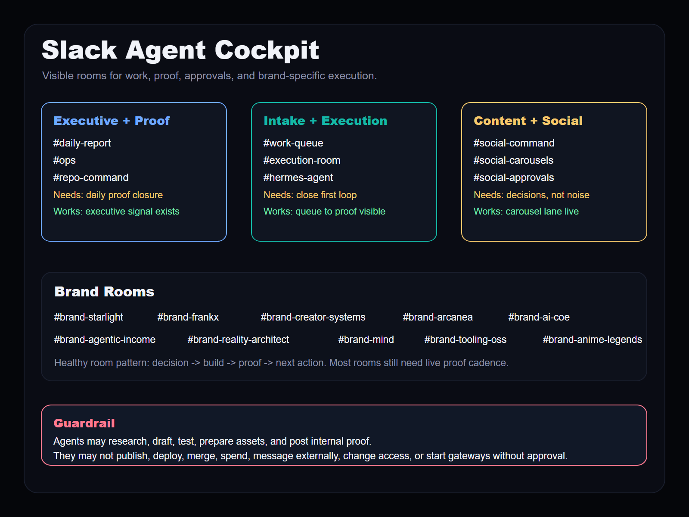

Source: `visuals/01-slack-agent-cockpit.svg`

## Agent Swarm Map

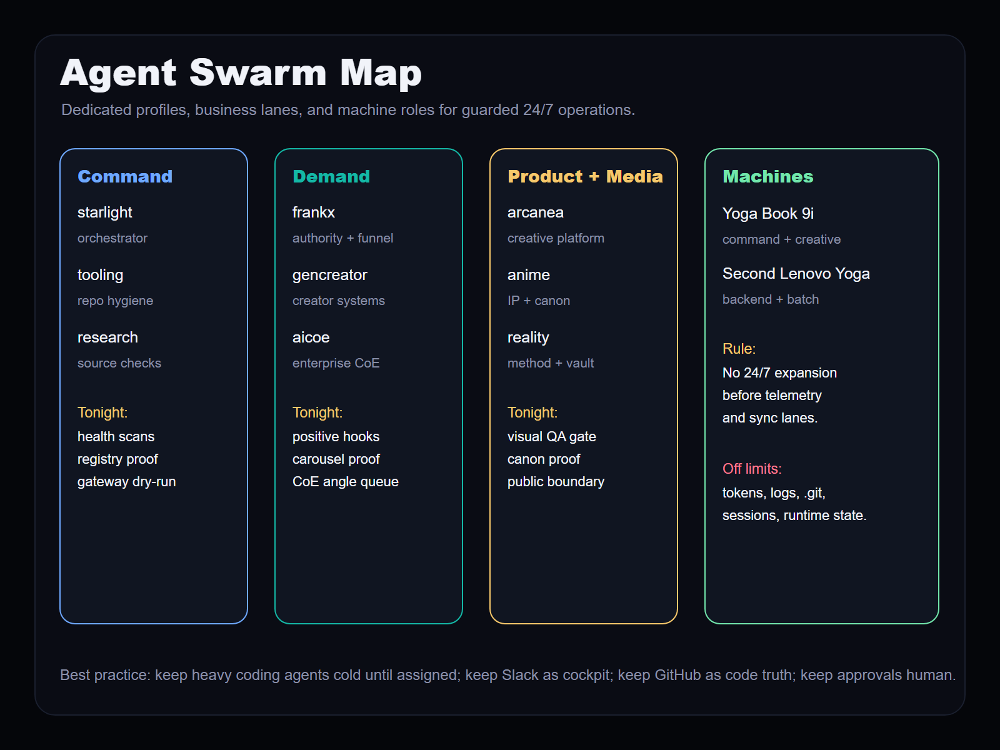

Source: `visuals/02-agent-swarm-map.svg`

## Social + Image Factory

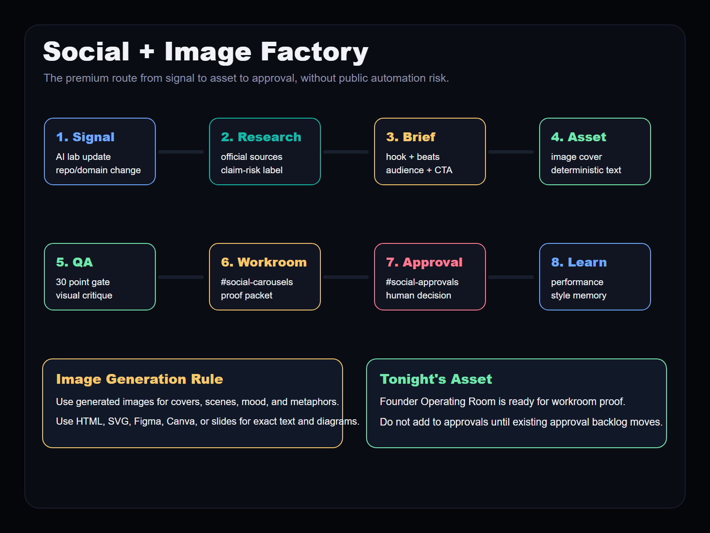

Source: `visuals/03-social-image-factory.svg`

## Tonight Action Board

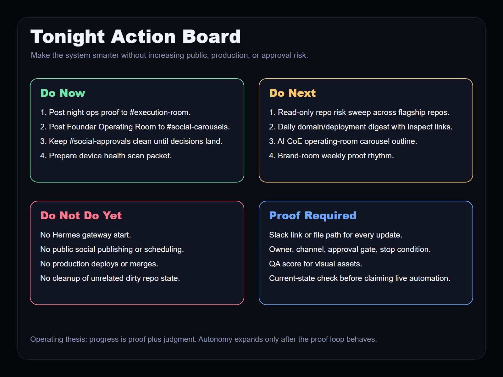

Source: `visuals/04-tonight-action-board.svg`

## Portfolio Business Signal Board

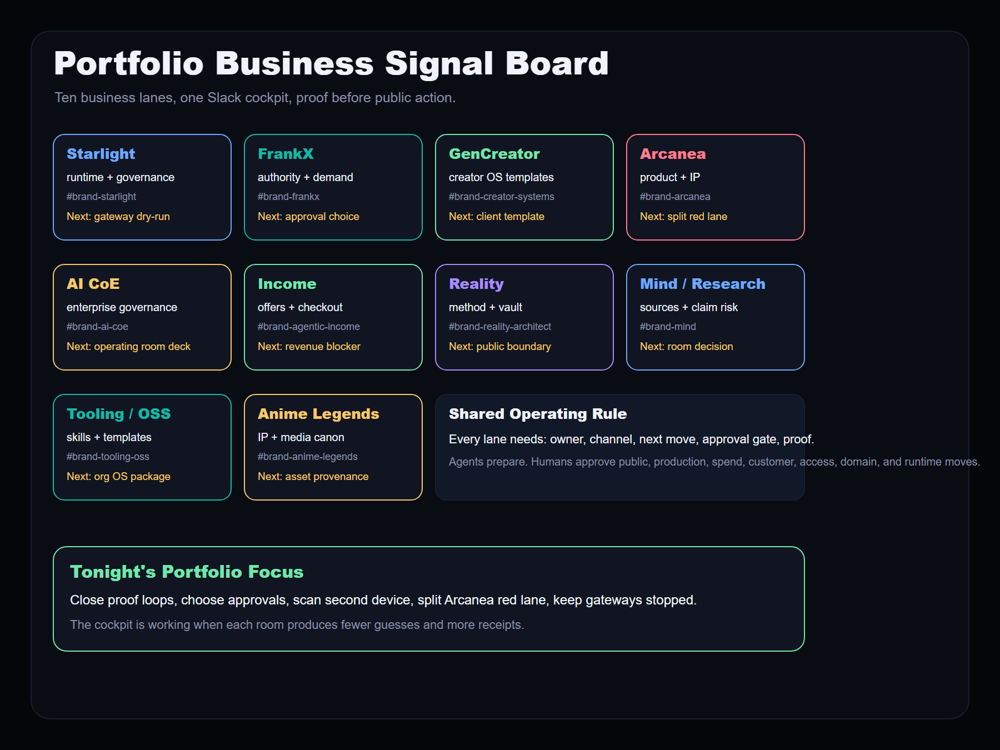

Source: `visuals/05-portfolio-business-signal-board.svg`

## Arcanea Red Lane Map

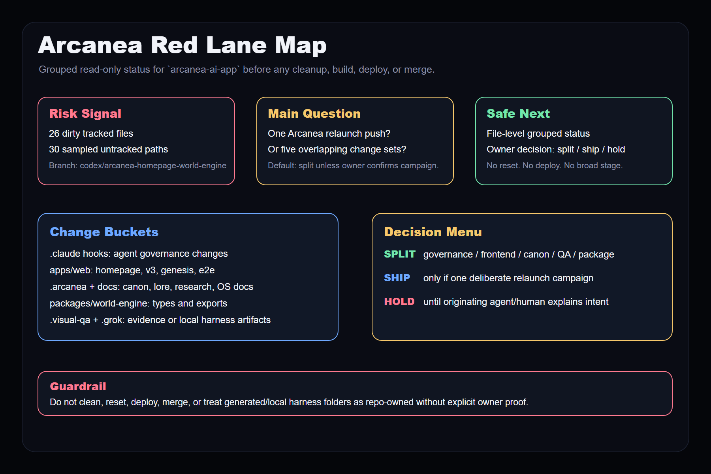

Source: `visuals/06-arcanea-red-lane-map.svg`

## Slack Proof Loop Scorecard

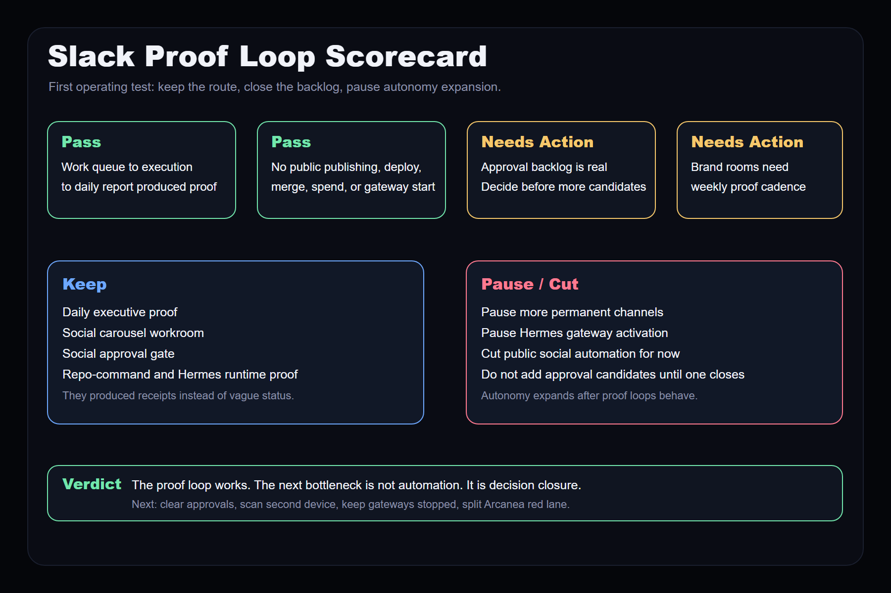

Source: `visuals/07-slack-proof-loop-scorecard.svg`

## Social Approval Backlog Board

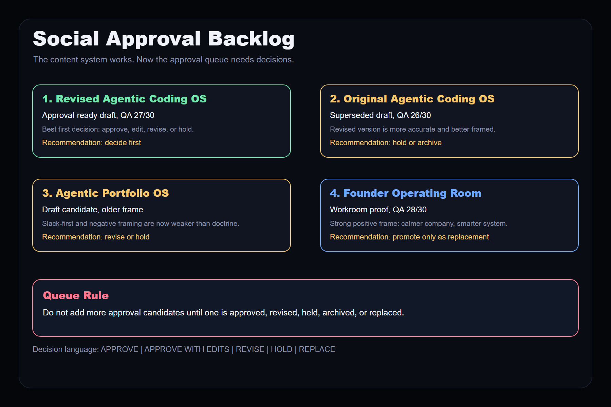

Source: `visuals/08-social-approval-backlog-board.svg`

## Domain Deployment Radar

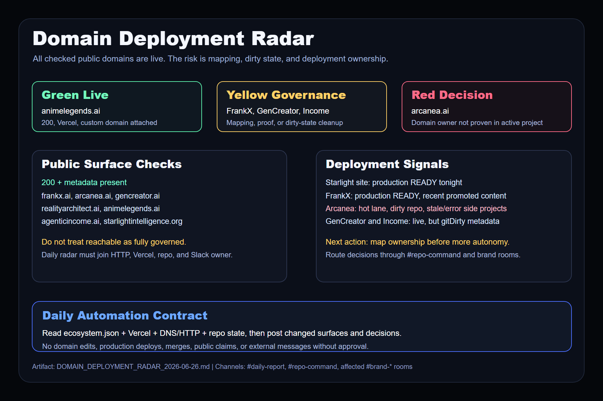

Source: `visuals/09-domain-deployment-radar.svg`

## Slack Channel Anchor Matrix

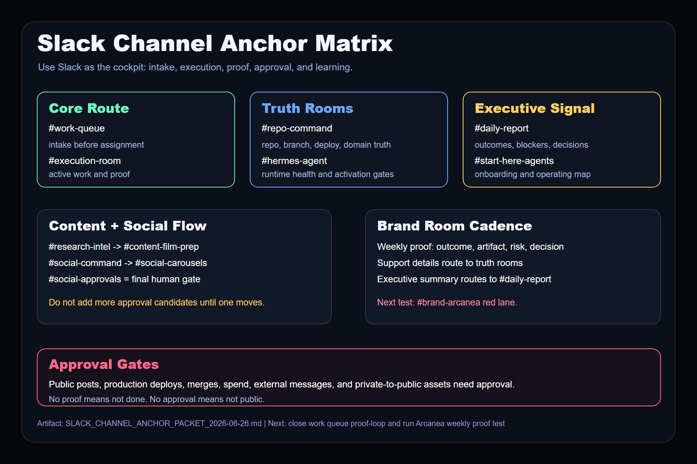

Source: `visuals/10-slack-channel-anchor-matrix.svg`

## Arcanea Weekly Proof

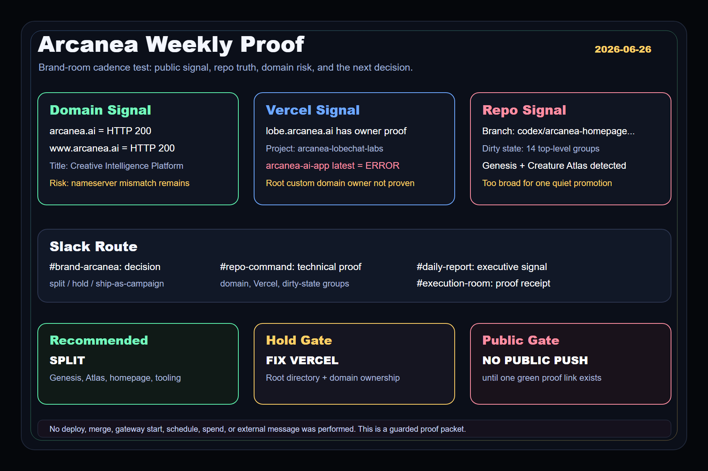

Source: `visuals/11-arcanea-weekly-proof.svg`
