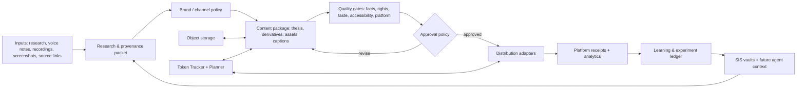

# Starlight Media Intelligence System (SMIS)

> **Status:** canonical strategy and first-wave execution contract
> **Date:** 2026-07-27
> **Owner:** `agentic-ops` control plane (private)
> **Decision:** build a sovereign, adapter-first media intelligence system; do **not** begin with a custom all-in-one social scheduler or a new repository.

## 1. The decision in one sentence

Build an owned **Media Intelligence Control Plane** that turns research, creator recordings, source assets, and experiments into governed content packages and measurable distribution receipts; use direct platform APIs or replaceable schedulers underneath it, not as the source of truth.

The first useful product is not an AI content firehose. It is a daily, high-taste **draft-to-approval-to-learning loop** that can safely become selective automation after it has earned trust.

## 2. What already exists and where this belongs

| Existing asset | Evidence | Role in SMIS | Must not become |
| --- | --- | --- | --- |
| `Starlight-Intelligence-System` | `README.md`, `AGENTS.md`: JSONL vaults + SQLite/FTS5, MCP, provenance, cross-agent memory | Sovereign memory, research provenance, learning, agent context | A social scheduler or a product-specific database |
| `agentic-creator-os` (ACOS) | `README.md`, `AGENTS.md`: MIT skills, commands, agents, connectors; Multimodal Studio | Portable creator workflows, skills, connectors, publish/checklist patterns | Frank-specific strategy, credentials, metrics, affiliate decisions |
| `agentic-ops` | `AGENTS.md`, `OPS-LEDGER.md`, `fleet/TOKEN-PLANNER.md`, `docs/AGENTIC-COMPANY-OPERATING-MODEL.md` | **Private control plane:** policies, queues, experiment registry, model routing, receipts, cross-brand coordination | A public-facing member application |
| `gencreator.ai` | `AGENTS.md`, `README.md`: Next.js member shell, research/library/community surfaces, Supabase | Future member-facing learning library, templates, selected product UI | The first operational back office |
| `FrankX` + production website | machine registry + FrankX instructions | Primary professional editorial brand and initial proving ground | The technical source of truth for multi-brand operations |
| `starlight-token-tracker` | `README.md`, `PRODUCT.md`, `SKILL.md` | Cross-machine LLM/token and subscription-utilization measurement | A content asset or publishing task bus |

### Ownership rule

- **SIS owns meaning and memory:** durable research facts, provenance, preferences, lessons, creative direction.
- **SMIS in `agentic-ops/ops/media-intelligence/` owns decisions and execution records:** policy, readiness, approvals, job state, experiment outcomes, provider routing.
- **Object storage owns binary media:** originals, b-roll, exports, captions, thumbnails, hashes.
- **A relational runtime store owns operational queries:** content package/job/receipt state and idempotency. Start with local JSON/SQLite only for the first vertical slice; move to a shared Postgres/Supabase service only after two brands or two machines need concurrent execution.
- **Git owns reviewed rules and public-safe templates:** skills, schemas, docs, adapters, versioned prompt contracts.
- **GenCreator owns a future teachable interface:** never make its production UI a prerequisite for proving the loop.

This keeps one source of truth per concern and respects the existing SIS → ACOS → FrankX/GenCreator architecture.

## 3. Non-negotiable operating principles

1. **Quality before volume.** A daily automation may create a candidate package; it does not earn publication rights by existing.
2. **Human intent is canonical.** A short voice note, raw recording, source link, or thesis is a first-class input. Generative media is one production mode, not the default identity of the company.
3. **Owned data, replaceable vendors.** Provider IDs, scheduled-post IDs, and generated asset IDs are external references. SMIS IDs, hashes, provenance, approvals, and receipts remain ours.
4. **Proof travels with claims.** Every researched claim is classified as external source, first-party observation, or editorial interpretation. Reuse never strips attribution or rights data.
5. **A channel is a policy domain, not merely a chat.** Connector permissions, brand voice, audience rules, approval thresholds, and knowledge packs are explicit and scoped.
6. **Automation is staged.** `draft` → `human approval` → `scheduled via adapter` → only later `policy-approved auto-publish` for narrow, reversible content classes.
7. **Measure outcome, not only tokens.** A cheap asset that never clears quality review is expensive. A flat subscription has a marginal price near zero but still needs utilization and outcome accountability.
8. **No secret in content context.** OAuth tokens and API keys sit in a secret manager; agents see scoped connector actions, never credentials.

## 4. Reference architecture



### The six layers

| Layer | Responsibility | Initial implementation | Later implementation |
| --- | --- | --- | --- |
| L1 Intelligence | Trend/source scan, original thesis, audience question | daily briefing + research packet | source graph + topic-opportunity scoring |
| L2 Editorial | Transform an idea into platform-native story arcs | creator brief + content package | reusable series and narrative graph |
| L3 Production | Record, generate, edit, caption, package assets | human recording + selected image/video/editor tools | b-roll retrieval and assisted edit pipeline |
| L4 Assurance | Facts, rights, brand, accessibility, policy, quality | explicit checklist and human approval | policy engine + reviewer agents with evidence links |
| L5 Distribution | Idempotent scheduling/publish + receipts | one direct adapter and one scheduler pilot | channel adapter library and queue worker |
| L6 Learning | Performance, quality, cost, review feedback, reuse | experiment ledger + weekly review | cross-brand recommendation system |

## 5. Canonical objects and minimum contracts

Every record has an SMIS ID, a brand ID, timestamps, source/provenance references, and a tamper-evident local receipt history. Do not allow vendor objects to become canonical IDs.

```ts
// Conceptual contract; implement the JSON schema before building a dashboard.
type ContentPackage = {
  id: string;                       // smis_cp_...
  brandId: string;                  // frankx | gencreator | arcanea | ...
  campaignId?: string;
  thesis: string;
  audienceJob: string;
  sourcePacketIds: string[];
  assetIds: string[];
  derivatives: Array<{
    channelId: string;
    format: 'carousel' | 'reel' | 'short' | 'video' | 'thread' | 'article' | 'newsletter';
    caption: string;
    accessibility: { altText?: string[]; captions?: boolean };
    status: 'draft' | 'review' | 'approved' | 'scheduled' | 'published' | 'failed';
  }>;
  approval: { policyVersion: string; requiredRoles: string[]; receiptIds: string[] };
  experimentId?: string;
};

type DistributionJob = {
  id: string;                       // smis_dj_...
  packageId: string;
  channelId: string;
  adapter: string;                  // meta-graph | youtube-api | postiz | manual
  idempotencyKey: string;
  mode: 'dry_run' | 'schedule' | 'publish';
  scheduledFor?: string;
  state: 'queued' | 'running' | 'succeeded' | 'failed' | 'cancelled';
  externalRefs: Record<string, string>;
};

type Experiment = {
  id: string;                       // smis_exp_...
  hypothesis: string;
  alternatives: string[];
  successMetric: string;
  guardrails: string[];
  costModel: 'metered' | 'flat_subscription' | 'hybrid';
  preRegisteredAt: string;
  result?: { decision: 'adopt' | 'pilot' | 'watch' | 'reject'; evidenceIds: string[] };
};
```

### Required evidence fields

| Object | Required evidence |
| --- | --- |
| Source packet | URL/file hash, publisher/author if known, capture date, rights/permission state, claim classification |
| Asset | original/generative/hybrid origin, model/tool/version, prompt or edit recipe, source file hash, license/consent notes |
| Content package | thesis, intended audience job, brand and channel policy versions, attribution/citation mapping |
| Approval | reviewer, role, decision, checklist version, timestamp, rationale |
| Distribution receipt | adapter, idempotency key, platform post ID/URL, response state, scheduled/published time |
| Outcome | collected time window, channel metrics, qualitative feedback, cost and effort, decision |

## 6. Brand and channel topology

Do not make one permanently-running “agent swarm” for every channel on day one. That creates expense, duplicated context, and credential risk. Start with **logical workspaces**, then elevate only when isolation is justified.

| Scope | Store | Isolation threshold | Example |
| --- | --- | --- | --- |
| Shared Starlight substrate | SIS vaults + common schemas | Always shared | research methods, tool evaluations, reusable skills |
| Brand workspace | private SMIS policy/knowledge pack | Separate voice, commercial intent, or audience | FrankX, GenCreator, Arcanea |
| Channel workspace | connector scope + channel policy + queue | Separate OAuth account, high posting cadence, or distinct moderator | FrankX Instagram, GenCreator YouTube |
| Campaign/series | content package collection | Temporary purpose, shared thesis | “Creator Intelligence Stack 2026” |
| Agent session/topic | Hermes thread + scoped task packet | Ephemeral work, not a data boundary | draft a carousel from approved research |

A dedicated Hermes profile is warranted only where credentials, automation cadence, context, or permission boundaries differ materially. Most work should use the existing `publishing-house` or default profile with a content package attached, not proliferate profiles.

## 7. Distribution strategy: direct APIs first, schedulers as adapters

### Verified platform facts (retrieved 2026-07-27)

| Platform | What the official source establishes | Architectural consequence |
| --- | --- | --- |
| Instagram | Meta’s [Content Publishing](https://developers.facebook.com/documentation/instagram-platform/content-publishing) guide was updated 2026-06-30. It supports single images, videos/reels, and carousel posts for professional accounts; it requires a public media URL at publishing time, tokens/login setup, and can be blocked by Page Publishing Authorization. | Treat the asset URL/CDN, OAuth refresh, PPA readiness, and publish receipts as first-class. A carousel pilot is feasible; use a dry-run and manual approval gate first. |
| YouTube | Google’s [Videos: insert](https://developers.google.com/youtube/v3/docs/videos/insert) supports upload and metadata. The live reference states: unverified projects created after 2020 are restricted to private uploads until audited; max file size is 256 GB; it requires an upload OAuth scope; the documented Video Uploads quota is 100 calls/day at 1 unit/call. | Build a YouTube adapter that begins in private/unlisted verification mode. Audit/readiness is a launch dependency, not a later surprise. |
| OpenAI image generation | OpenAI’s [Image Generation guide](https://developers.openai.com/api/docs/guides/image-generation) documents GPT Image models and both Image API and Responses API paths for generation/editing. | Use it as a metered, reproducible provider adapter. Persist model, parameters, prompt/edit recipe, source hash, and output hash; do not treat a Chat subscription as proof of production API rights. |
| LinkedIn | The current [Posts API](https://learn.microsoft.com/en-us/linkedin/marketing/community-management/shares/posts-api?view=li-lms-2026-07) supports member and organization writes through explicit OAuth and Page-role/scoped permissions. | A direct adapter is feasible; treat member and organization permissions as distinct capability records. |
| X | The documented [Create Post](https://docs.x.com/x-api/posts/create-post.md) endpoint is a user-context write API. X policy allows informational scheduling but prohibits manipulative or substantially identical cross-account automation. | Pilot a direct adapter with cross-brand duplicate detection and explicit commercial-tier/feature checks. |
| TikTok | The [Content Posting API](https://developers.tiktok.com/doc/content-posting-api-get-started) has Direct Post, but unaudited clients are private/`SELF_ONLY` constrained and public distribution needs audit; user consent and commercial/music disclosure controls are part of the integration. | Pilot behind a non-bypassable pre-publish consent and disclosure gate; do not promise autonomous public distribution before audit. |
| Postiz | The public [Postiz repository](https://github.com/gitroomhq/postiz-app) is AGPL-3.0 and its current security-advisory posture requires quarantine. | Synthetic-account UI/connector research only until exact-version remediation and a security review; never give it production OAuth tokens or canonical data. |

### Decision ladder

| Need | Default | Why |
| --- | --- | --- |
| One or two owned accounts where a direct API is available | Direct official adapter | Lowest hidden behavior; full receipt and idempotency control |
| Cross-platform calendar, human approvals, or temporary unsupported channel | Scheduler adapter (Buffer pilot or isolated synthetic-account scheduler comparison) | Good UX without yielding the control plane |
| A platform lacks safe API access or terms prohibit the desired action | Manual assisted publishing | Preserve package/provenance and record manual receipt; do not browser-automate around policy |
| A tool provides only consumer UI/credits | Human-in-the-loop creative production | Treat it as a creative provider, not an unattended backend |

**Explicit non-decision:** Do not choose Buffer, Plotato, Postiz, Mixpost, BrightBean, or a direct Graph stack globally before running the same scored pilot. Buffer is a reasonable paid fallback/UI pilot; Mixpost is a permissive reference but lacks the required multi-platform coverage; Plotato has no verified public publishing contract in this research snapshot. Each has different channel coverage, auth, licensing, UX, security, and support trade-offs.

## 8. Tool and subscription experiment system

A tool is not “adopted” because a demo looks good. It gets an experiment card before it gets spend, credentials, or production authority.

### Experiment card

```yaml
id: smis-exp-2026-001
question: Can a provider create a premium 8-slide Instagram carousel that clears FrankX quality review faster than the current path?
owner: media-queen
brand: frankx
alternatives: [current-approved-path, provider-a, provider-b]
fixed_input: source_packet_hash + creative_brief_hash
acceptance:
  - no factual or rights failure
  - quality reviewer median >= 4/5
  - usable export >= 80 percent
  - time_to_approved_package <= baseline
  - repeatable recipe recorded
cost_model: metered | flat_subscription | hybrid
pre_registered_metrics: [quality, time, cost, failure_rate, reuse, reach]
stop_conditions: [rights_unclear, no_supported_export, secret_exposure, policy_violation]
```

### Scorecard

| Dimension | Measure | Weight in early pilots |
| --- | --- | ---: |
| Taste and brand fit | blinded 1–5 review from Visual Director + Brand Editor | 25% |
| Editorial usefulness | package clears fact/rights/accessibility gate | 20% |
| Time to approved output | human minutes + queue time | 15% |
| Reproducibility | recipe reruns successfully; deterministic assets/exports where possible | 10% |
| Rights and automation clarity | documented terms, export ownership, API/unattended rights | **hard gate** |
| Integration quality | webhook/API/MCP, structured export, idempotent behavior | 10% |
| Cost and token/credit efficiency | marginal cost + subscription utilization, normalized per approved package | 10% |
| Outcome | saves, shares, watch time, clicks, qualified signups—not vanity impressions alone | 10% |

### Cost truth

Extend the existing Token Tracker model rather than creating another cost product:

- Token Tracker remains the SoT for local LLM usage and subscription-budget health.
- SMIS stores **content-production cost events** keyed to a package/experiment: metered API estimate, credits consumed if disclosed, operator minutes, and an `included_in_flat_subscription` flag.
- Never add weekly, monthly, lifetime, or flat-plan values together.
- Separate `marginal_cost_estimate` from `allocated_subscription_value`; label list-price estimates as estimates, never invoices.
- The decision metric is **cost per approved, published, outcome-qualified package**, not cost per raw generated asset.

## 9. Agent design and model routing

### The initial team (roles, not permanent expensive daemons)

| Role | Mission | Inputs → outputs | Default lane |
| --- | --- | --- | --- |
| Media Queen | selects daily opportunity; routes work; resolves trade-offs | opportunity queue → approved task packets | Hermes/Grok + Token Planner |
| Research Lead | sources and labels claims, trends, and permissions | source packet | long-context survey then focused reviewer |
| Editorial Producer | turns thesis into platform-native narrative | source packet → scripts/captions/carousel outline | ACOS content workflows |
| Visual/Video Director | creates asset brief, chooses tool, captures recipe | creative brief → asset set | ACOS Multimodal Studio + approved providers |
| Human Capture Coach | converts Frank’s raw recording/yap into shots, b-roll list, edit brief | recording intent → capture packet | human-first workflow |
| Distribution Steward | validates account readiness and sends idempotent jobs | approved derivative → receipt | direct adapter/scheduler adapter |
| Quality Sentinel | fact, rights, voice, accessibility, platform policy gate | package → approve/revise/block | separate reviewer pass |
| Learning Analyst | joins outcome, cost, and review evidence | receipts + metrics → experiment decision | Hermes/Grok + Tracker |

Use the existing Token Planner routing: Hermes/Grok for orchestration, Gemini 3.5 for broad repository/context mapping, Claude for hard multi-file/TDD work, Codex for bounded mechanical implementation, and human-in-loop UI work on the Book. Every autonomous run gets an explicit budget, stop condition, and evidence artifact.

## 10. The daily operating loop

1. **Collect** — creator voice note/recording, source links, ideas, performance signals.
2. **Select** — Media Queen produces a ranked opportunity packet; one thesis is chosen.
3. **Prove** — Research Lead writes a source packet with claim classification and rights constraints.
4. **Package** — Editorial + Visual/Video agents make a parent package and channel derivatives.
5. **Gate** — Quality Sentinel checks evidence, voice, safety, visual quality, accessibility, and platform readiness.
6. **Approve** — human approves, revises, or rejects. Rejection feedback becomes a learning event.
7. **Distribute** — adapter runs dry-run/schedule/publish with an idempotency key; receipt is recorded.
8. **Learn** — collect comparable metrics at a defined window; update experiment ledger and SIS memory.

### Publication autonomy policy

| Stage | Allowed automation | Required proof |
| --- | --- | --- |
| Stage 0: research | daily scans and draft queue only | source/provenance rules |
| Stage 1: assisted publishing | generate packages; human clicks/approves every publication | 10 accepted packages, no policy/rights incident |
| Stage 2: scheduled publishing | system schedules pre-approved packages in defined windows | adapter dry-runs, receipts, rollback/cancel tested |
| Stage 3: narrow auto-publish | only evergreen, low-risk, pre-templated content classes | 20 successful stage-2 jobs, 30-day clean record, explicit human policy sign-off |

Never auto-publish news, health/financial/legal claims, partner content, reposts of other creators, or experimental video without explicit review.

## 11. First vertical slice: 14 days

**Objective:** establish a real, measured daily content loop for **FrankX Instagram carousel + YouTube private/unlisted video validation**, connected to the FrankX → GenCreator bridge. No production auto-posting in this phase.

| Day | Deliverable | Acceptance check |
| ---: | --- | --- |
| 1–2 | SMIS canonical schemas, brand/channel policy files, experiment ledger | JSON schema validation; no credentials in Git |
| 3 | Research packet and content-package templates | one packet links claims to sources and distinguishes analysis |
| 4 | Asset storage convention and manifest writer | original/export hashes and provenance fields present |
| 5–6 | `meta-graph` adapter **dry-run** for one professional Instagram test account | validates public asset URL, account/PPA readiness, idempotency key; no publish |
| 7 | YouTube adapter private/unlisted upload test | upload receipt includes ID/URL/state; observes project audit restriction if applicable |
| 8 | Postiz/scheduler comparison harness (no credentials committed) | same prepared package tested in direct vs scheduler UX/workflow |
| 9–10 | Create three content packages from one research thesis + one Frank recording | each includes carousel, short-video, blog/newsletter derivative plan |
| 11 | Independent quality review and revision pass | source, rights, voice, accessibility and taste checklist complete |
| 12 | Human-approved publication/schedule of one package | receipt and links stored |
| 13 | Metrics capture at defined window + cost ledger | data source, date, comparison window labeled |
| 14 | Experiment review: adopt/pilot/watch/reject | decision backed by scorecard, not anecdotes |

## 12. 90-day delivery sequence

### Phase A — Foundation and proof (weeks 1–2)

- Deliver the first vertical slice above.
- Create private SMIS control-plane folders in `agentic-ops`; publish only portable skills/templates to ACOS after they have worked.
- Activate a daily *draft-only* Media Pulse, not auto-publishing.
- Baseline time, review score, cost, and outcome for three packages.

### Phase B — Two-brand operating loop (weeks 3–6)

- Add GenCreator as the second brand with a distinct audience/CTA policy.
- Introduce a small relational runtime store and object-storage manifest; do not build a dashboard until operators use the ledger weekly.
- Pilot one scheduler alongside official adapters and score it using the same packages.
- Add b-roll/source-asset retrieval and a “recording-to-cut-list” workflow.
- Create the first public-safe **Creator Media Systems** research/resource pages only from verified tool cards; attach affiliate links only where disclosure and terms are clear.

### Phase C — Productize what works (weeks 7–12)

- Promote proven workflows as ACOS skills plus fixtures/evals.
- Build a GenCreator library/resource UI from the same public-safe registry, not duplicated prose.
- Add selectively approved channel adapters and safe schedule windows.
- Create a cockpit only after it can answer: what is queued, what is blocked, what was published, what performed, what it cost, and what the system learned.
- Package the method for GenCreator members: templates, policies, setup wizard, and practical “human recording + AI production” playbooks.

## 13. Proposed private control-plane layout

```text
agentic-ops/
  ops/media-intelligence/
    README.md                         # operating contract + commands
    schemas/                          # JSON schemas (package, job, receipt, experiment)
    policies/
      brands/<brand>.yaml             # voice, proof, CTA, exclusions
      channels/<brand>-<channel>.yaml # OAuth scope ref, format, autonomy stage
    registry/
      tools.json                       # evaluated tool cards; no secrets/prices requiring privacy
      experiments.jsonl                # append-only decisions
      sources.jsonl                    # research packets / provenance pointers
    queue/                              # draft → review → approved → archived
    receipts/                           # publish/schedule/metric receipts
    adapters/                           # thin direct/scheduler provider boundaries
    reports/                            # weekly media learning briefs
```

The actual runtime store and media objects can live outside the repository; Git stores reviewable contracts, sanitized receipts, schemas, and public-safe research only.

## 14. What we deliberately do not build yet

- A second generic social scheduler.
- Browser automation that bypasses a platform’s API, permissions, or terms.
- An always-running agent for every channel.
- A giant content dashboard before a ledger and a weekly decision ritual work.
- One mega-database that mixes private creator raw material, public research, secrets, product entitlements, and metrics.
- Affiliate pages built from unverified tool claims or inferred commercial rights.

## 15. Success criteria and decision gates

### 30-day success

- 10 source-backed packages created; 5 human-approved publications; zero rights/fact/policy incidents.
- The operator can answer in under two minutes: what is next, who approved it, where it was published, what it cost, and what was learned.
- At least one direct adapter has verified dry-run and receipt behavior.
- Every production tool is classified `adopt`, `pilot`, `watch`, or `reject`, with source links and a dated experiment record.

### 90-day success

- Two brands share the substrate without voice, credential, or data leaks.
- Daily draft flow is reliable; selected low-risk formats can schedule through a policy gate.
- GenCreator has a public-safe learning/resource surface powered by the same registry.
- Proven workflows have migrated to ACOS; private execution remains in SMIS.
- The system reports quality, outcomes, and cost per approved package—not only activity volume.

## 16. Immediate executive recommendation

1. **Make this first slice real before buying a fleet of subscriptions:** one Instagram carousel path, one YouTube validation path, one human-recording-to-derivative path.
2. **Run direct API and scheduler as a controlled comparison**, not an ideological choice. Direct adapters are the long-term baseline; schedulers are UX accelerators.
3. **Use SIS + ACOS + Token Tracker exactly at their existing seams** rather than creating a new “media OS” repository now.
4. **Treat GenCreator as the education/product layer after the private operating loop works.** This lets the community learn a proven system, not a slide deck.
5. **Start every day with a draft-only Media Pulse and a clear approval queue.** Earn publishing autonomy through receipts and outcomes.

---

## Appendix A — research sources and freshness rule

All vendor/API assertions are volatile. Re-fetch primary documentation before an implementation or commercial claim. The first snapshot above was checked on 2026-07-27.

- Meta: <https://developers.facebook.com/documentation/instagram-platform/content-publishing>
- Google: <https://developers.google.com/youtube/v3/docs/videos/insert>
- OpenAI: <https://developers.openai.com/api/docs/guides/image-generation>
- Postiz: <https://github.com/gitroomhq/postiz-app>

For every subscription or provider review, record separately:

1. Human-use rights and plan/credit terms.
2. API/MCP/automation surface and actual authentication mode.
3. Unattended commercial automation rights.
4. Export ownership, IP/training, data retention, and attribution rules.
5. Self-host/cloud feature parity and license boundaries.
6. Measured quality, operating experience, cost, failure rate, and downstream outcome.

A marketing page, consumer credit bundle, or account-authenticated MCP is not proof of commercial backend or white-label rights.
