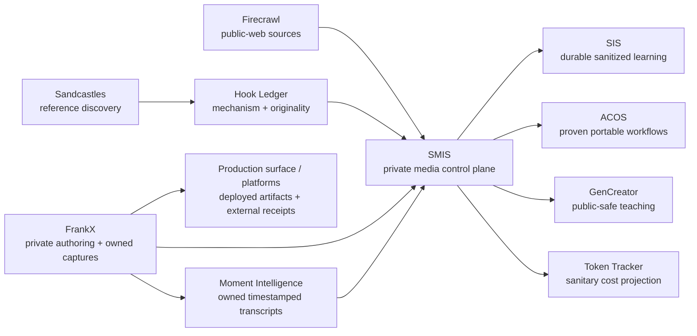

# SMIS Knowledge Graph

**Machine-readable source:** [`knowledge-graph.json`](knowledge-graph.json)

## Ownership at a glance

| System | Owns | Explicitly does not own |
| --- | --- | --- |
| SMIS / `agentic-ops` | policy, source references, decision state, approval/receipt semantics, experiments, media workflow contracts | secrets, raw media, social account authority, public product UI |
| SIS | durable provenance, memory, retrieved lessons, privacy-aware recall | SMIS queues, publishing state, scheduler jobs, cost accounting |
| ACOS | generic reusable skills, commands, templates | Frank-specific editorial policy, private outcome data, credentials |
| FrankX | private professional authoring, owned captures/assets, and editorial source records | deployment or the canonical live-site/platform publication artifact |
| `frankx.ai-vercel-website` / platforms | deployed public artifacts and their external deployment/post receipts | private authoring workspace or cross-brand workflow authority |
| GenCreator | public-safe teaching and member-facing learning experience | private operating back office or publishing control plane |
| Token Tracker | model/subscription/cost telemetry | editorial content or audience/publishing data |
| Sandcastles / Firecrawl | replaceable research inputs | canonical IDs, approvals, learned policy, or publishing authority |

## Connection discipline

Every arrow is one-way unless a later contract explicitly says otherwise. A projection must be minimized before it crosses a system boundary. In particular:

- SIS receives sanitized lessons, never raw media or credentials.
- ACOS receives only workflows already proven reusable.
- GenCreator receives public-safe teaching material, never private research exports or queue state.
- The FrankX authoring-to-production sync is a separate reviewed workflow; publication receipts belong to the production surface or platform.
- Vendors may provide inputs but never become the source of truth.
